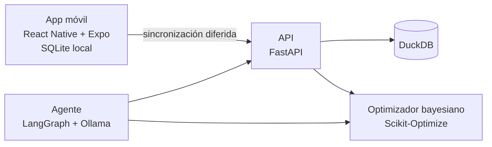

# BrewOptimizer AI

Sistema _local-first_ (sin nube y sin costos de infraestructura) que optimiza recetas de café en casa con _optimización bayesiana_, y que más adelante tendrá una app móvil offline y un agente conversacional con un LLM local.

> _Estado:_ en desarrollo. Sprints 0 y 1 completados. Ver el [avance](#avance).

## El problema

Mi papá y yo tenemos gustos de café muy distintos, y ninguno de los dos es catador experto. Cambiar gramos, temperatura o molienda "a ojo" no nos lleva a ningún lado, y no sabemos describir el sabor con números.

BrewOptimizer AI busca resolver eso con datos:

- Guarda cada taza (receta y puntuación) en perfiles separados por persona.
- Parte de nuestras recetas actuales, no de cero (_cold start_).
- Sugiere la siguiente receta a probar con optimización bayesiana.
- Resuelve el consenso cuando somos dos: "queremos Aeropress" combina ambos perfiles.
- Traduce descripciones libres ("me supo aguado pero rico") a puntuaciones con un LLM local.

## Arquitectura planificada



Esta es la arquitectura objetivo. Hoy existe el contrato de datos (`server/app/schemas.py`); el resto se construye por sprints.

## Stack

| Capa            | Tecnologías                                  |
| --------------- | -------------------------------------------- |
| Backend y datos | Python 3.12, FastAPI, Pydantic v2, DuckDB    |
| Optimización    | Scikit-Optimize (procesos gaussianos), NumPy |
| App móvil       | React Native, Expo, Expo Router, expo-sqlite |
| Agente de IA    | LangGraph, Ollama, Qwen 3 8B (local)         |
| Calidad         | pytest, Ruff                                 |

Todo es de código abierto y gratuito. El LLM corre en local sobre una GTX 1660 de 6 GB.

## Avance

| Sprint | Tema                                          | Estado     |
| ------ | --------------------------------------------- | ---------- |
| 0      | Preparación del repositorio y entorno         | Completado |
| 1      | Esquema de datos y validación                 | Completado |
| 2      | API (FastAPI) y DuckDB                        | Pendiente  |
| 3      | Optimizador bayesiano                         | Pendiente  |
| 4      | Consenso multiusuario                         | Pendiente  |
| 5      | Traducción de lenguaje natural a puntuaciones | Pendiente  |
| 6      | App móvil: navegación y almacenamiento local  | Pendiente  |
| 7      | Sincronización diferida                       | Pendiente  |
| 8      | Agente conversacional                         | Pendiente  |
| 9      | Pulido y publicación                          | Pendiente  |

## Esquema de datos

Cada taza preparada se guarda como un `BrewRecord` (`server/app/schemas.py`), validado con Pydantic v2. Es el contrato que comparten la API, la base de datos, el optimizador y el agente: ningún dato llega al modelo sin pasar por aquí.

### Campos

| Campo                                        | Tipo         | Requerido      | Regla                                                   | Descripción                                                             |
| -------------------------------------------- | ------------ | -------------- | ------------------------------------------------------- | ----------------------------------------------------------------------- |
| `user_id`                                    | texto        | Sí             | 1-50 caracteres                                         | Persona que preparó la taza. Cada una tiene su propio perfil.           |
| `method`                                     | enum         | Sí             | `v60`, `aeropress`, `espresso`, `french_press`, `moka`  | Método de preparación.                                                  |
| `brewed_at`                                  | fecha y hora | Sí             |                                                         | Momento de la preparación.                                              |
| `is_base_recipe`                             | booleano     | No (`false`)   |                                                         | Marca las recetas iniciales que siembran al optimizador (_cold start_). |
| `coffee_grams`                               | decimal      | Sí             | 1-100 g                                                 | Café molido.                                                            |
| `water_ml`                                   | decimal      | Salvo espresso | 20-1500 ml                                              | Agua usada.                                                             |
| `yield_grams`                                | decimal      | No             | 5-200 g, solo espresso                                  | Café líquido obtenido. Si falta, se asume 1:2.                          |
| `water_temp_c`                               | decimal      | Salvo moka     | 60-100 °C                                               | Temperatura del agua.                                                   |
| `brew_time_seconds`                          | entero       | Sí             | 10-900 s                                                | Tiempo de preparación.                                                  |
| `grinder`                                    | enum         | Sí             | `electric`, `manual`, `manual_espresso`                 | Molino usado.                                                           |
| `grind_setting`                              | decimal      | Sí             | 0-100                                                   | Clics (manuales, enteros) o posición del dial (eléctrico, 0-30).        |
| `bean_name`                                  | texto        | Sí             | 1-100 caracteres                                        | Grano usado.                                                            |
| `roast_level`                                | enum         | No             | `light`, `medium`, `dark`                               | Nivel de tostión.                                                       |
| `v60_dripper`                                | enum         | No             | `straight_ribs`, `spiral_ribs`, `lotus`; solo con `v60` | Modelo de V60.                                                          |
| `overall`                                    | decimal      | Sí             | 0-10                                                    | Nota general.                                                           |
| `sweetness`, `acidity`, `bitterness`, `body` | decimal      | No             | 0-10                                                    | Ejes de sabor. Opcionales porque no somos catadores expertos.           |

### Campos calculados

Se derivan de los demás y nunca se guardan, así no pueden contradecirlos.

| Campo                   | Cálculo                                                                                           |
| ----------------------- | ------------------------------------------------------------------------------------------------- |
| `ratio`                 | Líquido por gramo de café. Espresso usa el café líquido obtenido; los demás métodos usan el agua. |
| `effective_yield_grams` | Solo espresso: `yield_grams` si se midió; si no, el doble del café (18 g → 36 g).                 |

### Reglas entre campos

- `water_ml` es obligatorio salvo en espresso; `water_temp_c`, salvo en moka.
- `yield_grams` solo se acepta en espresso; `v60_dripper`, solo en V60.
- El dial del molino eléctrico llega hasta 30; los molinos manuales cuentan clics enteros.
- El `ratio` debe estar entre 1:1 y 1:25; fuera de ese rango casi seguro es un error de captura.
- Se rechaza cualquier campo desconocido, para que un error de tipeo no pase inadvertido.

### Decisiones de diseño

- **El molino es parte de la receta.** 20 clics en un molino no equivalen a 20 en otro.
- **Lo no medido se guarda como vacío, no como valor inventado.** El 1:2 del espresso se calcula aparte.
- **Ejes de sabor opcionales.** Se puede registrar solo la nota general y completar el resto después.

## Cómo correr el proyecto

Requisitos: Python 3.12 y Git. Comandos para Windows (PowerShell), desde la raíz del repositorio:

```powershell
cd server
python -m venv .venv
.venv\Scripts\activate
pip install -r requirements.txt
pytest
```

Por ahora solo hay pruebas del esquema de datos; la API llega en el Sprint 2.

## Estructura del repositorio

```
BrewOptimizer/
├── mobile/    # App React Native + Expo (Sprint 6)
└── server/    # Python: esquema, API, analítica, optimizador y agente
    ├── app/
    └── tests/
```

## Convenciones de trabajo

- **Ramas:** `main` siempre estable; ramas cortas por funcionalidad (`feat/...`, `fix/...`, `docs/...`) que se fusionan con _merge_.
- **Commits:** [Conventional Commits](https://www.conventionalcommits.org/) en inglés (`feat:`, `fix:`, `docs:`, `refactor:`, `chore:`).
- **Idioma:** el código y los commits van en inglés; la documentación, en español.
